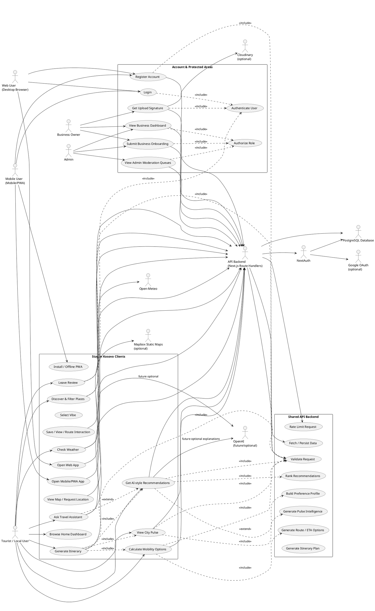
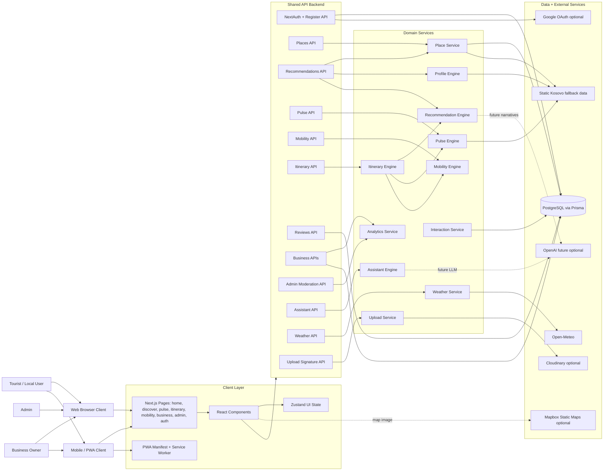

# Stay in Kosovo System Use Case Overview

## Scope Note

This repository currently contains one Next.js application, not three separate `web/`, `mobile/`, and `api/` packages. The codebase still behaves like a three-part system:

- **Web app:** desktop/tablet browser experience served by Next.js pages in `src/app`.
- **Mobile app:** mobile-first responsive/PWA experience using the same Next.js frontend, `public/manifest.webmanifest`, and `public/sw.js`.
- **Shared API backend:** Next.js route handlers in `src/app/api`, used by both web and mobile/PWA clients.

If a separate native mobile app is added later, it should consume the same `/api/*` endpoints described below.

## Full System Use Case Diagram

This is a standard UML use-case diagram in PlantUML format.



## Mermaid System Flow Diagram

This diagram is easier to render in Markdown tools that support Mermaid.



## Plain-English System Explanation

The app works as a layered system.

1. **The client layer** is what people see. It is built with Next.js pages and React components. A desktop visitor and a mobile visitor both load the same app; the UI is mobile-first and can behave like a PWA through the manifest and service worker.
2. **The shared API layer** lives inside the same Next.js app under `src/app/api`. Both the web UI and the mobile/PWA UI call these endpoints with `fetch()`.
3. **The service layer** contains business logic: ranking places, generating pulse intelligence, calculating mobility, creating itineraries, building profiles, answering assistant questions, and creating upload signatures.
4. **The data layer** is PostgreSQL accessed through Prisma. Some features also fall back to static Kosovo data so the prototype still works when the database is unavailable.
5. **External services** are optional integrations: Open-Meteo for weather, Mapbox for map imagery, Cloudinary for upload signatures, Google OAuth for login, and OpenAI as a future enhancement for richer explanations/chat.

The most common data flow is:

```txt
User action
  -> React component
  -> fetch('/api/...')
  -> Next.js API route
  -> Zod validation and rate limiting
  -> auth/role check if needed
  -> service function
  -> Prisma/PostgreSQL or fallback data
  -> JSON response
  -> React updates the UI
```

## Actors

| Actor | Role in the system |
| --- | --- |
| Tourist / local user | Browses places, gets recommendations, views city pulse, calculates routes, generates itineraries, leaves reviews, asks assistant questions. |
| Web user | Uses the same product from a desktop/tablet browser. |
| Mobile user | Uses the mobile-first/PWA version from a phone browser; same API calls, same auth/session model. |
| Business owner | Accesses business dashboard, submits business profiles, reviews visibility/analytics, can request upload signatures when authenticated. |
| Admin | Accesses protected moderation queues and platform metrics. |
| API backend | The shared API layer implemented as Next.js route handlers under `src/app/api`. |
| PostgreSQL database | Stores users, businesses, places, reviews, itineraries, interactions, check-ins, sessions, accounts, categories, events, and badges. |
| NextAuth | Handles login/session creation and role propagation. |
| Google OAuth | Optional external login provider when configured. |
| Open-Meteo | Weather provider for the weather strip. |
| Mapbox | Optional static map provider for discovery map imagery. |
| Cloudinary | Optional signed upload target. |
| OpenAI | Reserved/future enhancement for assistant/recommendation narratives; current recommendation logic is deterministic. |

## Use Case To Code Map

| Use case | Client code | API route | Service/domain code | Data/external dependency |
| --- | --- | --- | --- | --- |
| Open app shell | `src/app/layout.tsx` | none | `src/app/providers.tsx` | `public/manifest.webmanifest`, `public/sw.js` |
| Login | `src/app/auth/login/page.tsx` | `src/app/api/auth/[...nextauth]/route.ts` | `src/lib/auth/options.ts` | `User`, `Account`, `Session` in `prisma/schema.prisma`; optional Google OAuth |
| Register | `src/app/auth/register/page.tsx` | `src/app/api/auth/register/route.ts` | `src/lib/validation.ts`, `bcryptjs`, Prisma | `User` model |
| Role protection | protected `/business`, `/admin` pages | protected API routes | `src/middleware.ts`, `src/lib/auth/permissions.ts` | NextAuth JWT role |
| Discover/filter places | `src/components/discovery/discovery-board.tsx` | `src/app/api/places/route.ts`, `src/app/api/places/[id]/route.ts` | `src/services/place-service.ts` | `Place`, `Category`, `Business`; fallback `src/data/kosovo-data.ts` |
| Map/location view | `src/components/discovery/map-panel.tsx` | none directly | `src/hooks/use-geolocation.ts` | Browser geolocation, optional Mapbox static image |
| Save/view/route interaction | `src/components/discovery/place-card.tsx` | `src/app/api/interactions/route.ts` | `src/services/interaction-service.ts`, `src/services/profile-engine.ts` | `UserInteraction`; fallback profile delta |
| Recommendations | `src/components/home/ai-recommendations.tsx` | `src/app/api/recommendations/route.ts` | `src/services/recommendation-engine.ts`, `src/services/profile-engine.ts`, `src/services/place-service.ts` | `Place`, `UserInteraction`; fallback data |
| City pulse | `src/components/pulse/pulse-console.tsx`, `src/components/home/pulse-command-center.tsx` | `src/app/api/pulse/route.ts` | `src/services/pulse-engine.ts` | fallback places/events/transport; future interaction streams |
| Mobility | `src/components/mobility/mobility-panel.tsx` | `src/app/api/mobility/route.ts` | `src/services/mobility-engine.ts` | static transport points |
| Itinerary generation | `src/components/itinerary/itinerary-builder.tsx` | `src/app/api/itinerary/route.ts` | `src/services/itinerary-engine.ts`, recommendations, pulse, mobility | `Itinerary`, `ItineraryStop`, `Place` |
| Reviews | `src/components/experiences/review-composer.tsx` | `src/app/api/reviews/route.ts` | validation + Prisma in route | `Review`, `Place`, `User` |
| Business dashboard | `src/components/business/business-dashboard.tsx` | `src/app/api/businesses/route.ts` | `src/services/analytics-service.ts` | role session; currently prototype metrics |
| Business onboarding | `src/components/business/onboarding-form.tsx` | `src/app/api/businesses/onboarding/route.ts` | validation + Prisma in route | `Business`, linked `Place`, `Category` |
| Admin moderation | `src/components/admin/admin-console.tsx` | `src/app/api/admin/moderation/route.ts` | `src/services/analytics-service.ts` | admin role; currently prototype queues |
| Assistant chat | `src/components/assistant/chat-assistant.tsx` | `src/app/api/assistant/route.ts` | `src/services/assistant-engine.ts` | deterministic recommendations; OpenAI future optional |
| Weather strip | `src/components/home/weather-strip.tsx` | `src/app/api/weather/route.ts` | `src/services/weather-service.ts` | Open-Meteo with fallback weather |
| Upload signature | no full upload UI currently wired in visible pages | `src/app/api/upload/signature/route.ts` | `src/services/upload-service.ts` | authenticated session, optional Cloudinary env vars |
| Health check | external monitor/developer | `src/app/api/health/route.ts` | recommendation and pulse explainers | environment/database configured state |

## Include / Extend Relationships

| Relationship | Meaning in this codebase |
| --- | --- |
| Login includes Authenticate User | `src/lib/auth/options.ts` checks email/password with Prisma and `bcryptjs`. |
| Register includes Validate Request | `registerSchema` in `src/lib/validation.ts` validates name/email/password/role before user creation. |
| Recommendations include Validate Request | `recommendationSchema` validates the request before ranking. |
| Recommendations include Fetch Places | `/api/recommendations` calls `getPlaces()` before `recommendPlaces()`. |
| Recommendations extend Build Preference Profile | If the user has a session and interactions, `/api/recommendations` builds a profile from recent `UserInteraction` rows. |
| Itinerary includes Recommendations | `generateItinerary()` ranks places with `recommendPlaces()`. |
| Itinerary includes City Pulse | `generateItinerary()` calls `generateExperiencePulse()` to adjust rationale/context. |
| Itinerary includes Mobility | `generateItinerary()` calls `calculateMobilityOptions()` between stops. |
| Reviews include Authenticate User | `/api/reviews` rejects anonymous review creation. |
| Business dashboard/onboarding include Authorize Role | API routes require `BUSINESS_OWNER` or `ADMIN`. |
| Admin moderation includes Authorize Role | Middleware and route require `ADMIN`. |
| Upload signature includes Authenticate User | `/api/upload/signature` requires a signed-in user. |
| Assistant extends Recommendations | `answerTravelQuestion()` uses recommendation ranking to produce suggested places. |

## Layer Responsibilities

### Web/Mobile Client

- Renders pages and components.
- Holds UI preferences in Zustand.
- Calls `/api/*` endpoints for server data.
- Uses browser geolocation where the user allows it.
- Uses PWA assets and service worker for install/offline behavior.

### API Backend

- Accepts client requests.
- Validates payloads with Zod.
- Applies rate limits for user-input-heavy routes.
- Checks session/role where needed.
- Calls domain services.
- Reads/writes PostgreSQL through Prisma.
- Returns a consistent JSON shape through `ok()`/`fail()`.

### Services

- Keep business logic out of UI.
- Implement ranking, city pulse, route calculations, itinerary composition, profile learning, weather fetching, assistant answers, analytics, and upload signing.

### Database

- Owns persistent product data: users, roles, businesses, places, reviews, itineraries, interactions, check-ins, categories, sessions, accounts, and badges.

### External Integrations

- Open-Meteo supplies weather.
- Mapbox can supply static map images.
- Cloudinary can receive signed uploads.
- Google OAuth can authenticate users.
- OpenAI is planned as a narrative/chat upgrade, not required for current deterministic ranking.

## End-To-End Examples

### Tourist gets recommendations

1. User selects a vibe on the home page.
2. Zustand stores the selected vibe.
3. `AiRecommendations` posts to `/api/recommendations`.
4. The route validates the payload, loads places, checks session cookies, optionally loads recent interactions, builds a profile, ranks places, and returns JSON.
5. React renders recommended `PlaceCard` components.
6. Viewing/saving a card posts an interaction to `/api/interactions`, which can improve future personalization.

### Tourist generates an itinerary

1. User fills city, vibe, budget, duration, interests, and transport.
2. `ItineraryBuilder` posts to `/api/itinerary`.
3. The route validates and calls `generateItinerary()`.
4. The itinerary engine calls pulse, recommendation, and mobility logic.
5. If the user is signed in and the database exists, the itinerary and stops are persisted.
6. The UI displays a timeline with stop times, travel minutes, costs, and rationale.

### Business owner submits a business

1. Business owner logs in.
2. Middleware allows `/business/*` because the JWT role is `BUSINESS_OWNER` or `ADMIN`.
3. `OnboardingForm` posts to `/api/businesses/onboarding`.
4. The route requires role, validates payload, checks category, creates a `Business`, and creates a linked `Place`.
5. Admin moderation can later review pending businesses.

### Admin views moderation

1. Admin logs in.
2. Middleware allows `/admin` only for role `ADMIN`.
3. `AdminConsole` fetches `/api/admin/moderation`.
4. The route requires the `ADMIN` role and returns metrics plus business/review/location queues.

## Current Gaps Versus A True Three-App Architecture

- There is no separate native mobile source tree in this folder.
- There is no separately deployed API server package; the API is embedded in Next.js route handlers.
- Business and admin data are partly prototype/static responses in `analytics-service.ts` and the API routes.
- OpenAI is not currently called by the app; the assistant and recommendation logic are deterministic.

The good news is the backend API boundary already exists. A future React Native/Expo app could reuse these same `/api/*` endpoints with the same auth/session strategy adapted for mobile tokens.
